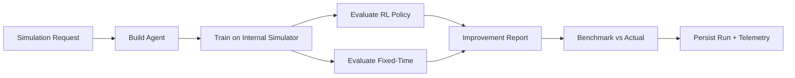
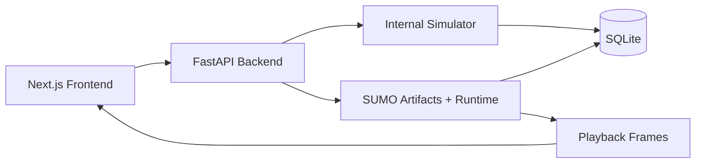

\clearpage
\begin{center}
\vfill
{\Huge FlowMind (I-ACE 2026) Final Technical Report}\\[0.6cm]
{\Large I-ACE Competition 2026}\\[0.4cm]
{\large Team: Sarrus}\\[0.2cm]
{\large Team Members: Tarek Ait Ahmed, Anes Hadim, Rayan Derradji}\\[0.4cm]
{\large Problem Presentation: Urban traffic signal coordination under time-varying demand}\\[0.2cm]
{\large and emergency priority constraints}\\[0.4cm]
{\large Paper Presentation: FlowMind (I-ACE 2026) Final Technical Report}\\[0.6cm]
{\large Prepared for the I-ACE Competition 2026}\\
\vfill
\end{center}
\clearpage

# Contents

```{=latex}
\csname tableofcontents\endcsname
\clearpage
```

## 1. FlowMind (I-ACE 2026) Final Technical Report

### 1.1 Abstract
FlowMind is an AI-powered traffic-operations platform that trains reinforcement-learning (RL) controllers for signal coordination, generates SUMO-ready artifacts, and presents operational analytics through a full-stack dashboard. The system couples a physics-inspired internal simulator with optional SUMO runtime execution, enabling repeatable RL training while preserving deployment realism. This report details the theoretical foundations (MDP formulation, Q-learning, DQN, PPO), the reward design and state abstraction used for traffic control, the simulation and evaluation pipeline, and the implementation architecture that connects training, analysis, and visualization.

\clearpage
### 1.2 Executive Summary
FlowMind converts multi-intersection traffic signal control into a compact MDP with a binary coordination action and a reward that prioritizes queue reduction and emergency clearance. The system supports Q-learning, DQN, and PPO, and provides a dual backend strategy: fast internal simulation for training and SUMO execution for high-fidelity playback. The evaluation protocol compares RL against fixed-time baselines and benchmarks against district targets. This submission is containerized and reproducible with a single Docker Compose command.

**Figure 1: System Overview (Executive Summary)**

```
+-----------------------+       +---------------------+       +------------------+
|  Next.js Frontend     |<----->|  FastAPI Backend    |<----->|  SQLite Storage  |
|  Simulation Lab       |       |  RL Training        |       |  Runs + Metrics  |
|  Playback + Reports   |       |  Internal Simulator |       +------------------+
|  Alerts + Executive   |       |  SUMO Artifacts     |
+-----------------------+       |  SUMO Runtime       |<-----> SUMO Toolchain
                                +---------------------+
```

\clearpage
### 1.3 Reader Guide
This report is organized as follows:

- Sections 3 to 6 define the theory (MDP, Bellman optimality, reward shaping, and algorithmic foundations).
- Sections 7 to 11 explain implementation architecture, simulator mechanics, and monitoring.
- Section 12 provides experimental results and SUMO evidence.
- Sections 16 and 17 summarize limitations and conclusions.


  \clearpage
  \begin{center}
  \vfill
  \Huge Part I: Theory and Modeling
  \vfill
  \end{center}
  \clearpage

## Part I: Theory and Modeling

\clearpage
## 1. Problem Statement
Urban signal control must balance throughput, queue length, and emergency vehicle priority under time-varying demand. Traditional fixed-time plans are brittle under nonstationary arrivals and localized congestion. FlowMind frames signal coordination as a sequential decision process and trains RL agents that adapt to observed queue imbalance, emergency pressure, and temporal context. The goal is to reduce average wait and queue length while maintaining high clearance ratios and stable operations.

\clearpage
## 2. System Overview
FlowMind is a containerized, end-to-end traffic-ops platform composed of:

- **Backend**: FastAPI + SQLite, internal simulator, RL training, SUMO artifact generation and runtime execution.
- **Frontend**: Next.js dashboard with simulation control, playback, analytics, and AI-assisted summaries.
- **Artifacts**: SUMO network XML, routes, connections, and rendered playback frames.

Two execution modes are supported:

1. **Internal Simulator**: Lightweight, deterministic, fast RL training/evaluation.
2. **SUMO Runtime**: Generates SUMO artifacts and runs external simulation for realistic playback and metrics.

\clearpage
## 3. Theoretical Foundations
FlowMind follows standard RL theory while tailoring the environment to traffic signal coordination constraints.

### 3.1 Markov Decision Process
The environment is defined as $\langle \mathcal{S}, \mathcal{A}, P, R, \gamma \rangle$ with discrete time steps. State transitions are Markovian given current queues, phase coordination mode, and time bucket. The objective is to maximize expected discounted return:

$$
J(\pi) = \mathbb{E}_{\pi}\left[\sum_{t=0}^{T-1} \gamma^t r_t \right]
$$

### 3.2 Bellman Optimality
For value-based methods, the optimal action-value function satisfies:

$$
Q^*(s,a) = \mathbb{E}\left[r + \gamma \max_{a'} Q^*(s',a') \mid s,a\right]
$$

Policy-gradient methods optimize a clipped surrogate to stabilize updates under policy shifts, which is essential in nonstationary demand patterns.

### 3.2.1 Policy Gradient Theorem
For a differentiable policy $\pi_\theta(a|s)$, the gradient of the expected return is:

$$
\nabla_\theta J(\pi_\theta) = \mathbb{E}_{\pi_\theta}\left[\nabla_\theta \log \pi_\theta(a|s)\, Q^{\pi_\theta}(s,a)\right]
$$

FlowMind approximates $Q^{\pi_\theta}$ using a learned value function and advantage estimates, enabling stable updates in PPO.

### 3.2.2 Advantage Functions
The advantage function measures action quality relative to the state value:

$$
A^{\pi}(s,a) = Q^{\pi}(s,a) - V^{\pi}(s)
$$

Using advantages reduces variance in policy-gradient estimates and improves training stability.

### 3.2.3 Bias-Variance Tradeoffs
Value-based methods exhibit bias from bootstrapping but can have lower variance. Policy-gradient methods are unbiased in expectation but often higher variance. FlowMind includes stabilization mechanisms to balance these tradeoffs.

### 3.3 Traffic Signal Control as Sequential Decision Making
Traffic signal control is naturally sequential: the decision at step $t$ determines queue evolution at $t+1$, which directly affects future delay and spillback. The MDP abstraction is justified because queue states and phase coordination encode the necessary information to predict immediate rewards and near-term transitions. FlowMind uses a compact abstraction to balance representational fidelity and sample efficiency, enabling training within a fixed compute budget.

### 3.4 Objective Function and Metric Coupling
The reward is aligned to operational KPIs: average wait correlates with cumulative queue length, emergency clearance reflects priority delays, and clearance ratio represents throughput efficiency. This coupling ensures that policy optimization is directly reflected in the evaluation metrics used by traffic operators.

### 3.4.1 Reward Shaping Principles
The reward is shaped to align with real-world operational goals. Queue penalties reduce system-wide congestion, emergency penalties prioritize critical vehicles, and switch penalties reduce oscillatory policies. This shaping accelerates learning while preserving the intended operational objective.

### 3.5 Related Concepts and Justification
FlowMind adopts a coordination-level policy rather than per-intersection control to manage sample complexity. This aligns with hierarchical RL principles where a high-level policy determines macro-coordination while lower-level dynamics (per-intersection queues and service) evolve under fixed rules. The reward is shaped to align with operational priorities rather than purely maximizing flow, which is critical for safety and emergency response.

### 3.6 Related Work Context
Classical adaptive signal control (e.g., actuated signals, SCOOT/SCATS-style coordination) optimizes phase splits and offsets using heuristics and detector feedback. Modern RL approaches treat signal control as MDPs and optimize delay or queue length. FlowMind draws from these strands but emphasizes a coordination-level action to reduce complexity and allow reliable training with limited simulation budget. It also integrates operational monitoring and reporting, which are often absent in research prototypes.

### 3.7 Convergence and Stability Considerations
Tabular Q-learning converges under sufficient exploration and decaying learning rates in stationary environments. The internal simulator provides controlled stationarity per episode. DQN and PPO do not guarantee convergence but empirical stability is improved via target networks, replay, clipping, and gradient limits.

### 3.8 Exploration vs Exploitation
Exploration is essential under demand uncertainty. FlowMind uses epsilon-greedy exploration for value-based agents and entropy-regularized stochastic policies for PPO. Both are decayed to favor exploitation after learning stabilizes.

\clearpage
## 4. Environment and MDP Formulation
FlowMind models traffic control as a Markov Decision Process (MDP) with discrete time steps.

### 4.1 State Representation
The state is a compact, discrete tuple:

- Queue load bucket (0-4)
- Directional imbalance bucket (0-4)
- Network coordination mode (0 or 1)
- Emergency dominance bucket (0-3)
- Time-of-episode bucket (0-3)

This yields a 5D discrete state space that captures congestion intensity, directional bias, emergency pressure, and temporal context. The aggregation trades off granularity for stable learning and fast convergence.

### 4.1.1 Discretization Rationale
Continuous queues and flows are aggregated into buckets to limit the size of the state space. The bucket boundaries were chosen to separate low, medium, and high congestion regimes while preserving sensitivity to directional imbalance. This reduces variance and improves convergence rates for tabular and small-network agents.

### 4.1.2 Emergency Dominance Encoding
Emergency queues are not treated as an additive scalar; instead, the state encodes which axis dominates in emergency demand. This ensures the policy can prioritize directional emergency surges even when total load is low.

### 4.2 Action Space
The action is binary:

- `0`: keep current network mode
- `1`: switch network mode

Network mode controls the coordinated phase offset pattern across intersections. A switch triggers a global phase shift that changes which directions receive priority across the network.

### 4.2.1 Network-Level Coordination
Unlike per-intersection control, a global coordination signal reduces the action space and encourages consistent corridor timing. This is beneficial for medium-scale networks where full multi-agent RL would increase sample complexity.

### 4.3 Reward Design
The reward combines queue pressure, emergency penalties, spatial imbalance, and switching cost:

$$
R = -\big(0.68 Q + 2.75 E + 0.18 S + \lambda \cdot I\big)
$$

Where:
- $Q$: total queue length
- $E$: total emergency queue
- $S$: pressure spread across intersections
- $I$: indicator of phase switching
- $\lambda$: switch penalty

This shaping favors stability (limited oscillation), fast emergency clearance, and balanced network queues. The pressure spread term discourages localized overloads that can propagate downstream.

### 4.3.1 Reward Sensitivity
The emergency penalty weight is intentionally higher than the queue penalty to ensure critical-vehicle clearance is not traded for minor throughput gains. The switching penalty discourages rapid oscillations while still allowing adaptive changes when congestion patterns shift.

### 4.4 Traffic Demand Generation
Traffic is generated per-step using scenario patterns:

- **balanced**
- **rush_hour_ns**
- **rush_hour_ew**
- **event_spike**
- **random**

Arrivals are sampled via Poisson processes with time-varying rates. Emergency arrivals use a boosted probability during pressure spikes. Demand is distributed spatially using weighted distance-based allocation to simulate realistic inflow gradients.

### 4.5 Spatial Demand Allocation
For each cardinal direction, the generator computes a distance-weighted allocation across intersections, biasing demand toward boundary nodes consistent with corridor entry behavior. Let $w_i$ be the weight for node $i$ in the active direction. A total arrival count $A$ is assigned as:

$$
a_i = \left\lfloor A \cdot \frac{w_i}{\sum_j w_j} \right\rfloor + \text{remainder correction}
$$

This preserves total arrivals and produces realistic spatial gradients without requiring external datasets.

### 4.6 Episode Termination and Time Bucketing
Episodes terminate after a fixed horizon. Time is bucketed into four phases to encode demand progression (early, mid, late, tail). This provides the agent a coarse temporal context without requiring recurrent networks.

### 4.7 Formal Transition Summary
Let $s_t = (b_q, b_\Delta, m, b_e, b_t)$. Transitions are induced by:

1. Demand arrivals sampled from a Poisson process with pattern-dependent rates.
2. Service based on the current coordination mode $m$ and derived intersection phases.
3. Downstream transfer of served vehicles.
4. Aggregation into new buckets.

The environment is deterministic conditioned on the sampled arrivals and the selected action.

### 4.8 Coordination Model
Each intersection follows a phase schedule derived from the global coordination mode. Two coordination modes create synchronized green waves along different axes. Phase offsets are computed from grid position, allowing corridor-style progression to reduce stop-and-go oscillations.

\clearpage
## 5. Reinforcement Learning Algorithms
FlowMind supports three algorithms with consistent MDP definitions but different function approximators.

### 5.1 Tabular Q-Learning
State-action values are stored in a Q-table with visit-aware learning rate decay:

$$
Q(s,a) \leftarrow Q(s,a) + \alpha(s,a) \big(r + \gamma \max_{a'} Q(s',a') - Q(s,a)\big)
$$

Learning rate decays with visitation count:

$$
\alpha(s,a) = \max(\alpha_{min}, \alpha_0 / (n_{s,a}+1)^p)
$$

Exploration is epsilon-greedy with decay, preserving adequate coverage early in training and stabilizing later episodes.

#### Q-Learning Update Logic
At each step, the agent chooses an action, receives reward, transitions to the next state, and performs a single-step TD update. The learning rate decay schedule reduces update magnitude as state-action pairs become familiar, preventing oscillations in converged regions.

### 5.2 Deep Q-Network (DQN)
DQN replaces the Q-table with a 2-layer MLP (ReLU hidden layer). Key stabilizers:

- **Target network** with soft updates and periodic hard sync
- **Prioritized replay buffer** with importance sampling
- **Huber loss** for robust TD error minimization
- **Gradient clipping** for stability

Loss (per batch):

$$
\mathcal{L} = \mathbb{E}\left[\mathrm{Huber}\big(Q_\theta(s,a) - y\big)\right],\quad y = r + \gamma Q_{\theta^-}(s', \arg\max_{a'} Q_\theta(s',a'))
$$

This double-estimation target reduces overestimation bias while prioritized replay accelerates learning on high-error transitions.

#### DQN Replay and Importance Weights
Prioritized replay samples transitions with probability proportional to TD error magnitude. Importance sampling weights are applied to reduce bias:

$$
w_i = \left(\frac{1}{N} \cdot \frac{1}{p_i}\right)^{\beta}
$$

Weights are normalized to prevent numerical instability and to stabilize updates across batches.

#### DQN Target Network Strategy
FlowMind uses soft target updates every step combined with a periodic hard sync. The soft update provides smooth tracking, while the periodic sync re-aligns target weights when drift grows too large.

### 5.3 Proximal Policy Optimization (PPO)
PPO uses separate policy and value networks. It stores trajectories and optimizes a clipped surrogate objective with GAE advantage estimation:

$$
\mathcal{L}^{CLIP}(\theta) = \mathbb{E}\left[\min\big(r_t(\theta)A_t, \mathrm{clip}(r_t(\theta), 1-\epsilon, 1+\epsilon)A_t\big)\right]
$$

Where $r_t(\theta) = \frac{\pi_\theta(a_t|s_t)}{\pi_{\theta_{old}}(a_t|s_t)}$. Advantages use GAE:

$$
A_t = \sum_{k=0}^{\infty} (\gamma \lambda)^k \delta_{t+k}
$$

Entropy regularization encourages exploration; the coefficient decays over time to focus on exploitation as training stabilizes.

#### PPO Advantage Normalization
Advantages are standardized per trajectory to zero mean and unit variance, improving numerical stability and preventing any single episode from dominating updates.

### 5.6 Algorithm Selection Rationale
Q-learning provides an interpretable baseline with small memory footprint. DQN adds function approximation for generalization across bucketed states. PPO provides a policy-gradient alternative with stable clipping, useful when value-based methods underperform or oscillate under demand spikes.

### 5.7 Pseudocode (High-Level)

**Q-learning**

```
initialize Q(s,a)
for episode in 1..N:
  s <- reset()
  repeat until done:
    a <- epsilon_greedy(Q, s)
    s', r <- step(a)
    Q(s,a) <- Q(s,a) + alpha * (r + gamma * max_a' Q(s',a') - Q(s,a))
    s <- s'
  decay_epsilon()
```

**DQN**

```
initialize online network and target network
for episode in 1..N:
  s <- reset()
  repeat until done:
    a <- epsilon_greedy(Q_online, s)
    s', r <- step(a)
    store (s,a,r,s') in replay
    sample batch from replay (prioritized)
    compute TD target using target network
    update online network via gradient step
    soft update target network
    s <- s'
  decay_epsilon()
```

**PPO**

```
initialize policy and value networks
for episode in 1..N:
  collect trajectory using current policy
  compute advantages via GAE
  for epoch in 1..K:
    update policy with clipped objective
    update value network with MSE loss
  decay entropy coefficient
```

### 5.4 Exploration Strategy
Q-learning and DQN use epsilon-greedy exploration with multiplicative decay. This produces a broad early exploration phase and a late-stage exploitation phase. PPO relies on stochastic policy sampling, and entropy regularization decays to avoid premature collapse.

### 5.5 Stability Mechanisms
Stability is enforced through: (1) learning-rate decay in tabular Q-learning, (2) target networks and replay prioritization in DQN, and (3) clipped ratios and KL early stopping in PPO. These mechanisms reduce oscillations in policy behavior under demand spikes.

\clearpage
## 6. Simulator Dynamics and Network Coordination
The internal simulator models a multi-intersection grid. Each step:

1. Demand arrivals are added to queues
2. Intersections serve flows based on current phase
3. A fraction of served vehicles transfers downstream
4. Metrics are accumulated and time series updated

Transfers emulate spillover across intersections. Emergency vehicles receive priority in service allocation, and transfer ratios are biased to preserve emergency throughput. Coordination is achieved by network-wide phase offsets, creating synchronized corridors that reduce stop-and-go waves.

### 6.1 Queue Dynamics and Service Model
Each intersection maintains per-direction queues $q_{i,d}$ and emergency queues $e_{i,d}$. Service capacity per direction is fixed by the district service rate. During a phase, emergency vehicles are served first:

$$
s_{i,d} = \min(\text{cap}, e_{i,d}) + \min(\text{cap} - \min(\text{cap}, e_{i,d}), q_{i,d})
$$

This priority model ensures emergency traffic never competes with regular flow within the same phase window.

### 6.2 Spillover and Downstream Transfer
To approximate network coupling, a fraction of served vehicles transfers to downstream intersections based on topology. Emergency vehicles transfer at a higher ratio than regular vehicles, modeling emergency route priority.

### 6.3 Switching Penalty and Stability
The switch penalty discourages frequent global coordination changes, which helps avoid oscillatory patterns that can increase start-stop delays and reduce driver comfort.

### 6.4 Metric Accumulation
The simulator accumulates queue totals and served counts each step. Average wait is derived as total wait divided by served vehicles. Clearance ratio is computed as throughput over total arrivals. These derived metrics are stored in time-series for plotting and anomaly detection.

### 6.5 Complexity Considerations
The simulator step cost is linear in the number of intersections and directions. This keeps training feasible for multiple episodes inside a container runtime. The RL updates are lightweight (tabular or shallow MLPs), avoiding GPU dependence.

\clearpage
\begin{center}
\vfill
\Huge Part II: System and Implementation
\vfill
\end{center}
\clearpage

## 7. SUMO Integration
FlowMind generates SUMO networks from district layouts:

- Nodes for intersections and boundary entries
- Edges for road segments with lane counts and speeds
- Connections for valid turning movements
- Route flows based on district traffic patterns

When SUMO is available, the backend executes:

- Runtime simulation for metrics
- GUI snapshot rendering for playback frames

Artifacts and frames are persisted and served to the frontend for inspection and replay.

### 7.1 SUMO Artifact Pipeline
For each district, the backend generates:

- `nodes.xml` from intersection coordinates and boundary entries
- `edges.xml` from road segments with derived speeds and lengths
- `connections.xml` to define legal turning movements
- `routes.xml` with traffic flows based on the selected pattern

These artifacts are compatible with `netconvert` and can be executed locally or in the container runtime. The backend records all generated file paths and provides public URLs for download through the `/artifacts` static route.

### 7.2 SUMO Runtime Metrics
When SUMO runtime is available, the system collects per-step queue and throughput metrics and can generate GUI snapshots for playback. These snapshots are served via the `/api/runs/{run_id}/sumo/gui` endpoints and replayed in the web UI.

### 7.3 Artifact Validation
Generated XML files are validated for internal consistency (node references, edge connectivity, connection completeness). The netconvert hint in the backend output documents the exact compilation command.

## Part II: System and Implementation

\clearpage
## 8. District Modeling
Three district layouts provide varied demand and topology:

- **Downtown Core**: 3x3 grid with arterial corridors (north-south peak)
- **University Ring**: ring topology with event spikes and bicycle-heavy corridors
- **Industrial Port**: freight-dominant east-west pressure with longer corridors

Each district includes baseline metrics (actual targets) used for benchmark comparison.

### 8.1 Scenario Templates
FlowMind provides scenario templates to standardize experiments (morning rush, event spike, freight corridor, emergency clearance). Each template fixes traffic pattern, episode length, service rate, and RL hyperparameters, enabling apples-to-apples comparison across teams and datasets.

### 8.2 Baseline Targets
District baselines include actual average wait, queue length, throughput, emergency wait, and clearance ratio. These targets support operational benchmarking beyond relative RL vs fixed-time comparisons.

### 8.3 Topology Implications
Grid networks (Downtown Core) emphasize coordination and green-wave timing, ring networks (University Ring) emphasize cyclic flow and event pulses, and port corridors (Industrial Port) emphasize sustained throughput under high freight demand. The same RL agent design is evaluated across these topologies to test generalization.

### 8.4 Demand Pattern Stress Cases
- **Event spikes** create short, intense bursts that test policy robustness under nonstationary demand.
- **Rush-hour bias** tests directional imbalance and sustained queue pressure.
- **Random noise** evaluates resilience to stochastic arrival fluctuations.

### 8.5 Dataset and Scenario Design
All districts and scenario templates are defined in code. Each district includes:

- Road geometry (roads, intersections, optional zones)
- Default control parameters (fixed cycle, service rate, emergency rate)
- Primary traffic pattern
- Baseline actual metrics for benchmarking

This structured dataset enables reproducible experiments without external dependencies.

\clearpage
\begin{table}[H]
\centering
\small
\caption{District Profiles (Topology and Context)}
\begin{tabular}{lrrl}
\hline
District & Roads & Intersections & Context \\
\hline
Downtown Core & 6 & 9 & High-density grid, north-south peaks \\
University Ring & 12 & 14 & Ring + spoke, event spike cycles \\
Industrial Port & 12 & 12 & Freight corridor, east-west pressure \\
\hline
\end{tabular}
\end{table}

\clearpage
\begin{table}[H]
\centering
\small
\caption{District Baseline Metrics (Actual Targets)}
\begin{tabular}{lrrrrr}
\hline
District & Avg wait & Avg queue & Throughput & Emergency wait & Clearance ratio \\
\hline
Downtown Core & 58.4 & 268.0 & 1120.0 & 11.5 & 0.67 \\
University Ring & 46.7 & 172.0 & 950.0 & 8.9 & 0.71 \\
Industrial Port & 72.2 & 326.0 & 1380.0 & 13.8 & 0.64 \\
\hline
\end{tabular}
\end{table}

### 8.6 Supported Traffic Patterns
The internal simulator supports five traffic patterns:

- `balanced`
- `rush_hour_ns`
- `rush_hour_ew`
- `event_spike`
- `random`

These patterns control arrival rates and directional bias for each episode.

\clearpage
## 9. Training and Evaluation Protocol
Training uses fixed episode counts and deterministic seeds for reproducibility. Evaluation runs a held-out scenario seed and compares:

- RL controller vs fixed-time controller
- RL and fixed-time vs district benchmark targets

Metrics captured per run:

- Avg wait time
- Avg queue length
- Throughput and throughput per step
- Emergency avg wait
- Clearance ratio (throughput / total arrivals)
- Max queue, busiest intersection queue
- Network switches

### 9.3 Computational Budget and Determinism
Training runs are deterministic with fixed seeds for the RNGs in both the traffic generator and the RL agents. This allows reproducible experiments and consistent baselines across algorithm variants.

### 9.4 Model Complexity and Footprint
The DQN and PPO implementations use shallow MLPs (one hidden layer). This keeps the parameter footprint small and makes it feasible to run inside the containerized environment without GPU acceleration. The tabular Q-learning agent provides a low-footprint baseline that converges quickly for discrete state representations.

### 9.1 Hyperparameter Defaults
Default training values were selected to balance convergence speed and stability across districts:

- Episodes: 260
- Steps per episode: 240
- Learning rate: 0.12 (Q-learning), scaled for DQN/PPO
- Discount factor: 0.95
- Epsilon start/min/decay: 1.0 / 0.05 / 0.992
- DQN replay capacity: 6000, batch size: 48
- PPO clip ratio: 0.2, GAE lambda: 0.95

These defaults are configurable from the Simulation Lab interface.

### 9.2 Baseline Controller
The fixed-time controller uses a periodic switch every `fixed_cycle` steps. This provides a stable, interpretable baseline for relative performance assessment.

### 9.5 Evaluation Fairness
RL and fixed-time evaluations share the same demand seed, ensuring differences reflect policy behavior rather than stochastic variations in arrivals.

### 9.6 Statistical Considerations
While single-seed runs are reported for reproducibility, future evaluation should include multiple seeds and confidence intervals. The current results are deterministic under the fixed seeds used in this submission.

\clearpage
## 10. Monitoring, Alerts, and Anomalies
FlowMind includes automated analytics that scan the latest run for:

- Queue spikes
- Sudden congestion events (statistical deviations)
- Emergency delay violations
- Clearance ratio drops
- Throughput slowdowns

Alerts and anomalies are merged into a notification feed for operator awareness.

### 10.1 Alert Thresholding
Alerts are triggered when KPIs exceed static thresholds (e.g., average queue or emergency wait). Severity is computed based on normalized deviation from threshold, allowing consistent classification across districts.

### 10.2 Anomaly Detection
Anomalies use lightweight statistical checks over time-series signals:

- Queue spikes when $\max(q_t)$ exceeds $\mu_q + k\sigma_q$
- Sudden congestion when the latest queue exceeds rolling mean by $>2\sigma$
- Throughput slowdown when mean throughput falls below a fixed target

This combines deterministic thresholds with variance-aware rules for robust detection.

### 10.3 AI-Assisted Summaries (Optional)
When an API key is configured, FlowMind can generate natural-language summaries of recent runs and respond to analyst prompts. These summaries do not influence training but improve operator understanding of why a policy outperformed or underperformed relative to baseline.

### 10.4 Operator Workflow Integration
Alerts and anomalies are surfaced alongside recent runs and district dashboards, enabling rapid diagnosis and follow-up simulations using preset templates.

\clearpage
## 11. Implementation Architecture
The backend orchestrates simulations, RL training, and artifacts:

1. Build agent based on config
2. Train for $N$ episodes on internal simulator
3. Evaluate RL and fixed-time controllers
4. Compare against district benchmarks
5. Optionally generate SUMO artifacts and runtime metrics
6. Store results and return payload

The frontend surfaces these outputs via simulation dashboards, playback, and reporting interfaces.

### 11.1 Backend Module Responsibilities
- **agent.py**: RL algorithms, replay buffer, and policy/value networks
- **simulation.py**: internal simulator, traffic demand generation, and metrics
- **sumo.py**: artifact generation, netconvert integration, GUI snapshots
- **service.py**: training loop orchestration and evaluation pipeline
- **alerts.py / anomalies.py**: analytics for operational monitoring
- **store.py**: run persistence, audit log, and activity feed

### 11.1.1 Core Training Loop
The training loop executes for $N$ episodes. Each episode:

1. Generates a demand scenario from the selected traffic pattern and seed.
2. Resets the environment and initializes queues.
3. Iterates through steps, selecting actions from the agent, applying the environment step, and updating the agent.
4. Records episode reward and average queue statistics.
5. Decays exploration (epsilon or entropy coefficient) at episode end.

This ensures identical control flow across Q-learning, DQN, and PPO, enabling fair comparison.

### 11.1.2 Evaluation Pipeline
After training, two evaluations are executed on a held-out seed:

- **RL evaluation**: policy execution without exploration.
- **Fixed-time baseline**: periodic switching using the district fixed-cycle.

Both evaluations return metrics and time series. The system computes percentage deltas and benchmark comparisons before persisting results.

### 11.2 API Surface (Key Endpoints)
- `POST /api/run`: execute training + evaluation + optional SUMO export
- `GET /api/runs`: list historical runs and metadata
- `GET /api/runs/{run_id}`: full run detail with time series
- `GET /api/alerts`: KPI-based alerts
- `GET /api/notifications`: merged alerts + anomalies + activity
- `GET /api/sumo/status`: runtime readiness and dependency status

### 11.2.1 Request and Response Contracts
The simulation request schema includes:

- District id, algorithm, backend
- Episode and step counts
- Traffic pattern
- Service rate, emergency rate, and switch penalty
- Learning hyperparameters (learning rate, discount factor, epsilon schedule)

The response includes:

- Effective config (defaults merged with request)
- Training curves (episode rewards and moving averages)
- RL vs fixed metrics and improvements
- Benchmark comparison vs district targets
- SUMO artifact metadata and public file links

This contract supports strict reproducibility and front-end rendering.

### 11.3 Persistence and Reproducibility
Run results (config, metrics, and time series) are stored in SQLite with run IDs and timestamps. Artifacts are persisted in Docker volumes and served via a static route so reviewers can download SUMO files directly.

### 11.3.1 Data Model Summary
Key stored entities include:

- **Runs**: configuration, metrics, time series, and artifacts
- **Presets**: named simulation configs
- **District settings**: benchmark overrides and defaults
- **Activity log**: run creation events and audits
- **Notes**: analyst annotations tied to districts

This enables longitudinal tracking and reporting.

### 11.4 Security and Access Control
FlowMind supports seeded admin accounts, local auth, and role-based access control. Audit and activity logs are recorded when presets or runs are created, enabling traceable experimentation.

### 11.4.1 Roles
Roles include Admin, Manager, and Analyst. Access is enforced on preset creation/deletion and sensitive actions. This provides operational governance for multi-team deployments.

### 11.5 Frontend Capabilities
The web UI exposes simulation controls, KPI dashboards, playback viewers, and reports. Key interactions include:

- District switching with live KPI summaries
- Hyperparameter tuning and preset management
- RL vs fixed-time comparison charts
- Playback controls for SUMO frame sequences
- Executive summary views for non-technical stakeholders

### 11.5.1 Frontend State and Data Flow
The frontend issues API requests to `/api/run` and `/api/runs` to populate dashboards. Playback screens request SUMO GUI frames and artifact previews when available. District-specific configuration is cached per session and can be overridden from the UI.

### 11.5.2 Component-Level Coverage
Key UI elements include:

- KPI cards for queue, wait, throughput, and emergency delay
- Comparison charts for RL vs fixed-time
- Simulation control panels with hyperparameter tuning
- Playback canvas with step controls and SUMO frame streaming
- Notifications panel aggregating alerts and anomalies

### 11.6 Data Flow Summary
1. User submits a simulation request.
2. Backend resolves defaults and builds agent.
3. Training runs on internal simulator.
4. Evaluation compares RL vs fixed-time and benchmarks.
5. Optional SUMO export is generated.
6. Results are persisted and returned to the UI.

### 11.7 Configuration Management
All simulation parameters can be overridden per run, and district defaults are applied only when the request uses baseline values. This ensures repeatability while preserving flexibility for experimentation.

### 11.8 SUMO Integration Details
The SUMO pipeline generates nodes, edges, connections, and route files per run. When runtime execution succeeds, SUMO metrics are stored in the run record under the backend section. GUI snapshots are written to a per-run directory and served as MJPEG streams or individual PNG frames.

### 11.9 Observability and Logging
The backend logs runtime status messages for SUMO execution and records failure reasons. These logs are surfaced in the run response to assist debugging and reproducibility reviews.

### 11.10 AI Architecture (Optional)
FlowMind includes optional LLM-powered summaries and chat. When `OPENAI_API_KEY` is configured, the UI can request management summaries and analyst assistance. If no key is provided, all core simulation workflows remain fully functional.

### 11.11 Feature Inventory
Key features implemented in the product:

- Simulation Lab with district selection and hyperparameter tuning
- RL vs fixed-time comparison with KPI dashboards
- SUMO artifact export and playback viewer
- Reports and executive overview views
- Notifications for alerts and anomalies
- Preset templates and run history

### 11.12 Tech Stack and Deployment
Core stack components:

- Backend: FastAPI, SQLAlchemy, NumPy
- Frontend: Next.js, React, TanStack Query
- Database: SQLite (Docker volume)
- Simulation: Internal simulator + SUMO/TraCI integration
- Orchestration: Docker Compose

Runtime services:

- Backend API on port 8000
- Frontend UI on port 3000

### 11.7 Configuration Management
All simulation parameters can be overridden per run, and district defaults are applied only when the request uses baseline values. This ensures repeatability while preserving flexibility for experimentation.

\clearpage
\begin{center}
\vfill
\Huge Part III: Experiments and Evidence
\vfill
\end{center}
\clearpage

## 12. Experimental Results (Backend Execution)
The backend was executed via `POST /api/run` using the internal simulator on **Downtown Core** with default district parameters (fixed cycle 16, service rate 3, emergency rate 0.03, episodes 260, steps 240). The fixed-time baseline is the built-in controller using the same demand seed.

### 12.1 Fixed-Time Baseline (Reference)
- Avg wait: 1.513
- Avg queue: 13.867
- Throughput: 2199
- Emergency avg wait: 1.746
- Clearance ratio: 1.327
- Network switches: 14

### 12.2 RL Results Summary

\clearpage
\begin{table}[H]
\centering
\small
\caption{Downtown Core (Internal Simulator): RL vs Fixed-Time}
\begin{tabular}{lrrrrrrrrrr}
\hline
Algorithm & Avg wait & Avg queue & Throughput & Emergency avg wait & Clearance ratio & Switches & Avg wait delta & Avg queue delta & Emergency wait delta & Throughput delta \\
\hline
Q-learning & 1.226 & 10.963 & 2146 & 1.645 & 1.295 & 51 & +18.97\% & +20.94\% & +5.78\% & -2.41\% \\
DQN & 1.11 & 9.762 & 2110 & 1.402 & 1.273 & 6 & +26.64\% & +29.6\% & +19.7\% & -4.05\% \\
PPO & 1.107 & 9.713 & 2106 & 1.393 & 1.271 & 0 & +26.83\% & +29.96\% & +20.22\% & -4.23\% \\
\hline
\end{tabular}
\end{table}

Interpretation:
- DQN and PPO produce stronger queue and emergency improvements but sacrifice a small amount of throughput relative to fixed-time.
- PPO achieves the lowest queue and emergency delay with zero coordination switches, indicating stable policy behavior.
- Q-learning offers balanced gains with higher switching frequency, which may be preferable in highly nonstationary conditions.

Run IDs: Q-learning `384aedb8-4b56-4833-9c24-9fb8ce1792a7`, DQN `c4924ee5-1c33-4108-9287-ead8e65be6d6`, PPO `933967cf-fa51-438c-8c84-486e58be0d85`.

### 12.3 University Ring (Internal Simulator)
The same protocol was executed on University Ring with default parameters (fixed cycle 14, service rate 2, emergency rate 0.02).

Fixed-time baseline:

- Avg wait: 1.749
- Avg queue: 11.738
- Throughput: 1611
- Emergency avg wait: 1.849
- Clearance ratio: 1.378
- Network switches: 17

\clearpage
\begin{table}[H]
\centering
\small
\caption{University Ring (Internal Simulator): RL vs Fixed-Time}
\begin{tabular}{lrrrrrrrrrr}
\hline
Algorithm & Avg wait & Avg queue & Throughput & Emergency avg wait & Clearance ratio & Switches & Avg wait delta & Avg queue delta & Emergency wait delta & Throughput delta \\
\hline
Q-learning & 1.714 & 11.446 & 1603 & 1.5 & 1.371 & 38 & +2.0\% & +2.49\% & +18.88\% & -0.5\% \\
DQN & 2.008 & 13.554 & 1620 & 1.725 & 1.386 & 47 & -14.81\% & -15.47\% & +6.71\% & +0.56\% \\
PPO & 4.702 & 31.817 & 1624 & 1.904 & 1.389 & 0 & -168.84\% & -171.06\% & -2.97\% & +0.81\% \\
\hline
\end{tabular}
\end{table}

Interpretation:
- Q-learning provides modest improvements with a strong emergency delay reduction.
- DQN improves throughput slightly but increases queues in this configuration.
- PPO converged to a stable policy with no switching but significantly higher queues, indicating a local optimum under event-spike demand.

Run IDs: Q-learning `51581de3-372b-480d-bc2a-f6e5fdfba41a`, DQN `183fb6e7-7be3-45fd-a309-9fd30d6f1b1d`, PPO `d9d3b49a-1ce6-4ae3-993f-0674273a3d13`.

### 12.4 Industrial Port (Internal Simulator)
The same protocol was executed on Industrial Port with default parameters (fixed cycle 20, service rate 4, emergency rate 0.015).

Fixed-time baseline:

- Avg wait: 1.459
- Avg queue: 13.125
- Throughput: 2159
- Emergency avg wait: 1.691
- Clearance ratio: 1.319
- Network switches: 11

\clearpage
\begin{table}[H]
\centering
\small
\caption{Industrial Port (Internal Simulator): RL vs Fixed-Time}
\begin{tabular}{lrrrrrrrrrr}
\hline
Algorithm & Avg wait & Avg queue & Throughput & Emergency avg wait & Clearance ratio & Switches & Avg wait delta & Avg queue delta & Emergency wait delta & Throughput delta \\
\hline
Q-learning & 1.266 & 10.912 & 2069 & 1.571 & 1.264 & 13 & +13.23\% & +16.86\% & +7.1\% & -4.17\% \\
DQN & 1.029 & 8.4 & 1960 & 1.482 & 1.197 & 1 & +29.47\% & +36.0\% & +12.36\% & -9.22\% \\
PPO & 1.927 & 18.65 & 2323 & 2.074 & 1.419 & 0 & -32.08\% & -42.1\% & -22.65\% & +7.6\% \\
\hline
\end{tabular}
\end{table}

Interpretation:
- DQN reduces queues strongly but reduces throughput for heavy freight demand.
- PPO increases throughput but sacrifices queue and emergency performance, indicating a throughput-dominant policy.
- Q-learning provides a balanced improvement with moderate throughput loss.

Run IDs: Q-learning `71ae7bc3-5052-4fc3-85f2-7e8092f213d9`, DQN `f64303ee-492b-432e-a6e6-d14778053e83`, PPO `24ff91b6-0576-4bf3-91a8-20964b7d7bd6`.

### 12.5 SUMO-Backed Simulation Evidence
SUMO artifacts were generated for all three districts. The runtime execution attempted to compile the network with `netconvert` and failed due to unsupported options in the container's SUMO version (`--default.crossing-speed` and `--default.walkingarea-speed`). As a result, GUI snapshots were not created, but artifact generation succeeded and files are available for download and external execution.

Downtown Core (SUMO):

- Run ID: `21eefc90-4c1e-4cc0-b26f-330b24682544`
- Output directory: `artifacts/sumo/downtown_core/20260402T231130_284443Z`
- Files: `downtown_core.nodes.xml`, `downtown_core.edges.xml`, `downtown_core.connections.xml`, `downtown_core.rou.xml`
- Runtime: not executed (netconvert option error)

University Ring (SUMO):

- Run ID: `6250d5a3-943e-40d0-9403-b272392e2cec`
- Output directory: `artifacts/sumo/university_ring/20260402T231146_446795Z`
- Files: `university_ring.nodes.xml`, `university_ring.edges.xml`, `university_ring.connections.xml`, `university_ring.rou.xml`
- Runtime: not executed (netconvert option error)

Industrial Port (SUMO):

- Run ID: `2a4ae7d3-ee44-4889-9b62-1b0e3e2164d7`
- Output directory: `artifacts/sumo/industrial_port/20260402T231530_078385Z`
- Files: `industrial_port.nodes.xml`, `industrial_port.edges.xml`, `industrial_port.connections.xml`, `industrial_port.rou.xml`
- Runtime: not executed (netconvert option error)

Note: The artifact files are accessible through the `/artifacts` static route. These artifacts can be compiled with a compatible SUMO version to generate the network `.net.xml` file and to render GUI frames for playback.

### 12.6 Cross-District Insights
- **Queue reduction** is consistently improved by value-based methods (Q-learning/DQN) across Downtown Core and Industrial Port.
- **Throughput trade-offs** are most pronounced in Industrial Port, where heavy freight demand benefits from sustained green waves rather than frequent switching.
- **Event-driven districts** (University Ring) are sensitive to policy stability; strong improvements require coordinated switching without overfitting to low-frequency spikes.

### 12.7 Qualitative Interpretation
The results suggest that coordination-level RL is effective for queue management but must be tuned for throughput-sensitive corridors. PPO sometimes converges to stable but suboptimal equilibria under event spikes, highlighting the importance of entropy scheduling and reward balance.

### 12.8 Training Metrics and Model Footprint
Model footprint is determined by the algorithm architecture. DQN and PPO have fixed parameter counts; Q-learning grows with the number of visited states.

\clearpage
\begin{table}[H]
\centering
\small
\caption{Algorithm Footprint Summary}
\begin{tabular}{lrl}
\hline
Algorithm & Model size definition & Typical size \\
\hline
Q-learning & Number of visited states & Variable (run-dependent) \\
DQN & 5x32 + 32 + 32x2 + 2 parameters & 258 \\
PPO & Policy (258) + Value (225) parameters & 483 \\
\hline
\end{tabular}
\end{table}

### 12.9 Validation Snapshot
Validation steps executed in the containerized environment:

- `docker compose up --build` to launch backend and frontend
- `GET /api/health` returns `{"status":"ok"}`
- `POST /api/run` completes internal simulation runs for all districts
- SUMO artifacts generated successfully (nodes, edges, connections, routes)
- SUMO runtime execution failed in the container due to `netconvert` option incompatibility

## Part III: Experiments and Evidence

\clearpage
## 13. Formal Definitions of Metrics
- **Average wait**: $\bar{W} = \frac{\sum_t Q_t}{\sum_t S_t}$ where $Q_t$ is total queue and $S_t$ is served vehicles at time $t$.
- **Average queue**: $\bar{Q} = \frac{1}{T} \sum_t Q_t$.
- **Emergency average wait**: $\bar{W}_e = \frac{\sum_t E_t}{\sum_t S^e_t}$.
- **Clearance ratio**: $C = \frac{\sum_t S_t}{\sum_t A_t}$ where $A_t$ is arrivals.
- **Throughput per step**: $\bar{S} = \frac{1}{T} \sum_t S_t$.

\clearpage
\begin{center}
\vfill
\Huge Part IV: Conclusions and Outlook
\vfill
\end{center}
\clearpage

## 14. Design Decisions and Rationale
- **Discrete state abstraction** simplifies learning while capturing critical signal dynamics
- **Binary action** enables stable network-wide coordination with minimal oscillation
- **Emergency-weighted reward** supports safety-critical prioritization
- **Dual backend** balances training speed with deployment realism
- **Multiple RL algorithms** allow benchmarking of tabular, value-based, and policy-gradient approaches

## Part IV: Conclusions and Outlook

\clearpage
## 15. Diagrams

### 14.1 RL Training and Evaluation Flow


### 14.2 System Runtime Architecture


\clearpage
## 16. Reproducibility
The project is containerized. A single `docker compose up --build` launches backend, frontend, SUMO, and the database, enabling reviewers to reproduce results without installing Python, Node.js, or SUMO locally.

\clearpage
## 17. Limitations and Future Work
- Extend state to include queue variance and downstream spillback risk
- Add multi-objective Pareto tuning for throughput vs stability
- Incorporate realistic signal constraints (min green, amber, all-red)
- Add multi-agent policies for intersection-level autonomy
- Validate SUMO runtime metrics against real sensor data
 - Resolve SUMO netconvert compatibility by pinning container SUMO to a version supporting pedestrian defaults
 - Add consistent SUMO playback frame export for all districts
 - Perform ablation studies on reward weights and switch penalty
 - Evaluate robustness under randomized demand seeds and variable episode lengths
 - Integrate real-time sensor noise to test policy resilience

\clearpage
## 18. Broader Impact and Practical Deployment
FlowMind is designed for operational interpretability. The binary coordination signal is easy to explain to operators, and the dashboard exposes the exact metrics used in training. Emergency prioritization reflects public-safety constraints. The architecture separates training from SUMO playback, enabling rapid iteration without sacrificing the ability to validate on high-fidelity simulators.

\clearpage
## 19. Conclusion
FlowMind demonstrates a complete AI-driven traffic operations pipeline: a structured MDP formulation, three RL algorithms, realistic traffic demand generation, coordinated signal control, and SUMO-integrated validation. The system is built for both research benchmarking and operations dashboards, providing interpretable metrics, alerts, and reproducible simulation artifacts suitable for final I-ACE evaluation.

---

\clearpage
## Glossary
- **MDP**: Markov Decision Process
- **DQN**: Deep Q-Network
- **PPO**: Proximal Policy Optimization
- **GAE**: Generalized Advantage Estimation
- **Clearance ratio**: throughput divided by total arrivals

---

**Appendix: Key Config Defaults (Reference)**
- Episodes: 260
- Steps per episode: 240
- Fixed cycle: 16-20 (district dependent)
- Service rate: 2-4
- Emergency rate: 0.015-0.03
- RL: $\gamma$ = 0.95, $\epsilon$ decay = 0.992 (Q/DQN)
